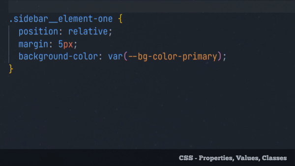
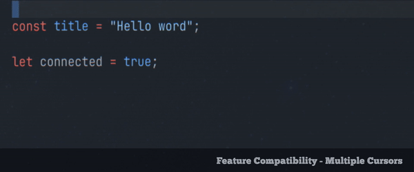
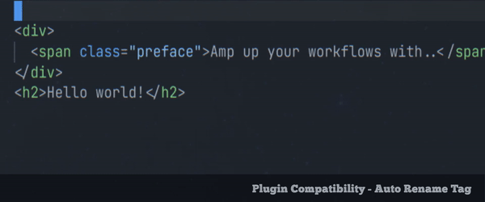

# Keyword-O-Mat

  

> _"Amp up your workflows. Quickly rotate related keywords that are commonly used in a variety of popular languages."_

## Examples

  
CSS - Properties, Values, Classes

 
  

TS, C++, PHP, Java - Access Modifiers <em>- click to unfold</em>

  

  
Multi cursor selection compatible

     
  

  

  
Extension compatible - Auto Rename Tag <em>- click to unfold</em>

 

## How To Use

|                | **Default Keymaps** | **Commands**           |
| -------------- | ------------------- | ---------------------- |
| Cycle Forward  | `Alt+a`             | `K-O-M Cycle Forward`  |
| Cycle Backward | `Alt+x`             | `K-O-M Cycle Backward` |

The default keybindings are inspired by VIM's _add_ `Ctrl-a` and _subtract_ `Ctrl-x`. Of course , you can remap them to your preference.

## Keyword List

| _Rotate symbols and words that are in one row_                                     |
| ---------------------------------------------------------------------------------- |
| `==` , `!=`                                                                        |
| `_` , `-`                                                                          |
| `+` , `-`                                                                          |
| `-=` , `+=`                                                                        |
| `&&` , `\|\|`                                                                      |
| `and` , `or`                                                                       |
| `true` , `false`                                                                   |
| `if` , `else`                                                                      |
| `YES` , `NO`                                                                       |
| `yes` , `no`                                                                       |
| `on` , `off`                                                                       |
| `running` , `stopped`                                                              |
| `first` , `last`                                                                   |
| `const` , `let`                                                                    |
| `private` , `protected` , `public`                                                 |
| `push` , `pull`                                                                    |
|                                                                                    |
| `div` , `p` , `span`                                                               |
| `max` , `min`                                                                      |
| `ul` , `ol`                                                                        |
| `class` , `id`                                                                     |
| `px` , `%` , `em`                                                                  |
| `left` , `right`                                                                   |
| `top` , `bottom`                                                                   |
| `margin` , `padding`                                                               |
| `height` , `width`                                                                 |
| `absolute` , `relative`                                                            |
| `h1` , `h2` , `h3` , `h4` , `h5` , `h6`                                            |
| `png` , `jpg` , `gif`                                                              |
| `linear` , `radial`                                                                |
| `horizontal` , `vertical`                                                          |
| `show` , `hide`                                                                    |
| `mouseover` , `mouseout`                                                           |
| `mouseenter` , `mouseleave`                                                        |
| `add` , `remove`                                                                   |
| `up` , `down`                                                                      |
| `before` , `after`                                                                 |
| `slow` , `fast`                                                                    |
| `small` , `large`                                                                  |
| `even` , `odd`                                                                     |
| `inside` , `outside`                                                               |
|                                                                                    |
| `include` , `require`                                                              |
| `Time` , `Date`                                                                    |
| `present` , `blank`                                                                |
| `while` , `until`                                                                  |
| `only` , `except`                                                                  |
| `create` , `update`                                                                |
| `new` , `edit`                                                                     |
| `get` , `post` , `put` , `patch`                                                   |
|                                                                                    |
| `one` , `two` , `three` , `four` , `five`                                          |
| `primary` , `secondary` , `tertiary` , `quaternary` , `quinary`                    |
| `Monday` , `Tuesday` , `Wednesday` , `Thursday` , `Friday` , `Saturday` , `Sunday` |

\*For single words and properties to be cycled, its sufficient when the cursor is placed above them. 
Symbols and linked words like `&&` or element-`one` currently require to be selected. 

## Known Issues

This is an early and extensible version of this extension. It's code offers a good basis to add functionalities.
Although its current features are simple, this state fulfills the requirements in the times I'm using VSCodium. Further development depends on whether the extension will have a user base with a need for more functionalities.
Features that I had in mind when working on this extension were, for example, file type specific keyword overrides and to set custom keyword maps inside a user's settings.json.

If you feel like it, please star or rate the repo to let me know that you use the extension and that you would like to see more features.
Also, bug reports, example gifs, feature- and pull requests are welcome.

## Release Notes

`*.*.n` version changes are tracked via commit history until `*.n.*` version relaeases

### 0.1.0

Initial release

## Credits

Similar extensions and projects that served as an inspiration.

-  [Toggle Boolean](https://github.com/silesky/vscode-toggle-bool)
-  [Swap Keywords](https://github.com/L13/vscode-swap/tree/master/src)
-  [vim-cycle](https://github.com/zef/vim-cycle)
