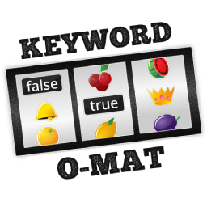
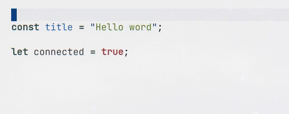
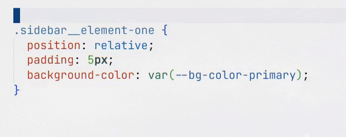
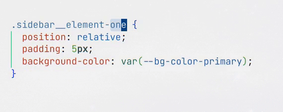
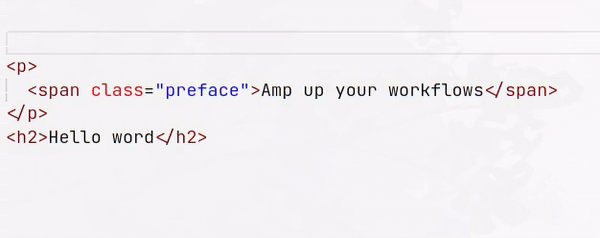
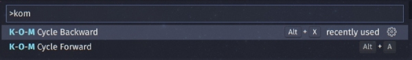
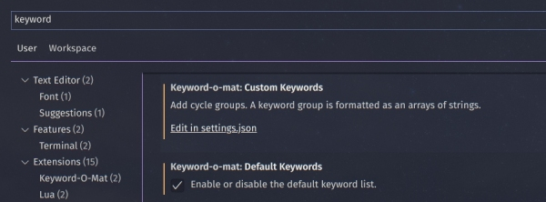

# Keyword-O-Mat

<div align="center">
  

> _"Amp up your workflows. Quickly swap related keywords."_

</div>

## Examples

Switch variables, booleans and commonly used keywords





<details>
  <summary>Multi cursor selection compatible <em>- click to unfold</em></summary>
  

  
</details>

<details>
  <summary>Extension compatible - Auto Rename Tag <em>- click to unfold</em></summary>
  
</details>

## How To Use



|                | **Default Keymaps** | **Commands**           |
| -------------- | ------------------- | ---------------------- |
| Cycle Forward  | <kbd>Alt+a</kbd>    | `K-O-M Cycle Forward`  |
| Cycle Backward | <kbd>Alt+x</kbd>    | `K-O-M Cycle Backward` |

<sub>The default keybindings are inspired by VIM's _add_ <kbd>Ctrl-a</kbd> and _subtract_ <kbd>Ctrl-x</kbd>.<br>
Of course , you can remap them to your preference.</sub>

## Settings

Settings are accessible via the GUI settings and your `settings.json` file.<br>
Choose whether you want to use the default keywords and add custom cycle groups.



### Custom Keywords

Simply create a custom keyword cycle group by adding it as an array to your `settings.json`.<br>
E.g., if one of the groups you want to add should cycle through `foo` / `bar` / `baz` it would look like:

```json
"keyword-o-mat.customKeywords": [
  ["foo", "bar", "baz"],
  ["veggies", "fruits", "berries"]
],
```

### Default Keywords

| _Rotate symbols\* and words that are in one row_                                   |
| ---------------------------------------------------------------------------------- |
| `&&` , `\|\|`                                                                      |
| `and` , `or`                                                                       |
| `true` , `false`                                                                   |
| `if` , `else`                                                                      |
| `YES` , `NO`                                                                       |
| `yes` , `no`                                                                       |
| `on` , `off`                                                                       |
| `running` , `stopped`                                                              |
| `const` , `let`                                                                    |
| `private` , `protected` , `public`                                                 |
| `push` , `pull`                                                                    |
|                                                                                    |
| `div` , `p` , `span`                                                               |
| `max` , `min`                                                                      |
| `ul` , `ol`                                                                        |
| `class` , `id`                                                                     |
| `px` , `%` , `em`                                                                  |
| `left` , `right`                                                                   |
| `top` , `bottom`                                                                   |
| `margin` , `padding`                                                               |
| `height` , `width`                                                                 |
| `absolute` , `relative`                                                            |
| `h1` , `h2` , `h3` , `h4` , `h5` , `h6`                                            |
| `png` , `jpg` , `gif`                                                              |
| `linear` , `radial`                                                                |
| `horizontal` , `vertical`                                                          |
| `show` , `hide`                                                                    |
| `mouseover` , `mouseout`                                                           |
| `mouseenter` , `mouseleave`                                                        |
| `add` , `remove`                                                                   |
| `up` , `down`                                                                      |
| `before` , `after`                                                                 |
| `slow` , `fast`                                                                    |
| `small` , `large`                                                                  |
| `even` , `odd`                                                                     |
| `inside` , `outside`                                                               |
| `above` , `below`                                                                  |
|                                                                                    |
| `include` , `require`                                                              |
| `Time` , `Date`                                                                    |
| `present` , `blank`                                                                |
| `while` , `until`                                                                  |
| `only` , `except`                                                                  |
| `create` , `update`                                                                |
| `new` , `edit`                                                                     |
| `get` , `post` , `put` , `patch`                                                   |
|                                                                                    |
| `one` , `two` , `three` , `four` , `five`                                          |
| `first`, `second`, `third`, `forth`, `fifth`, `last`                               |
| `primary` , `secondary` , `tertiary` , `quaternary` , `quinary`                    |
| `Monday` , `Tuesday` , `Wednesday` , `Thursday` , `Friday` , `Saturday` , `Sunday` |
| `TODO` , `DOING` , `DONE` , `CANCELED`                                             |
| `NOW` , `LATER`                                                                    |

<small>\* A visual selection is required when the cycle element is a:

-  Word separated by a hyphen, e.g., _element-`one`_
-  Symbol like _`&&`_

It is sufficient to place the cursor above the cycle element when it is a:

-  Word surrounded by spaces, parentheses, or double quotes

 </small>

## Release Notes

### 0.2.0

-  Users can define custom keyword cycle groups in their `settings.json`
-  Add option to disable default keywords

### 0.1.0

-  Initial release

## Outlook

-  [x] User created keyword groups
-  [x] Option to disable default keywords
-  [ ] Language(filetype) specific keywords
-  [ ] Advanced user options

## Credits

Similar extensions and projects that served as an inspiration.

-  [Toggle Boolean](https://github.com/silesky/vscode-toggle-bool)
-  [Swap Keywords](https://github.com/L13/vscode-swap)
-  [vim-cycle](https://github.com/zef/vim-cycle)
